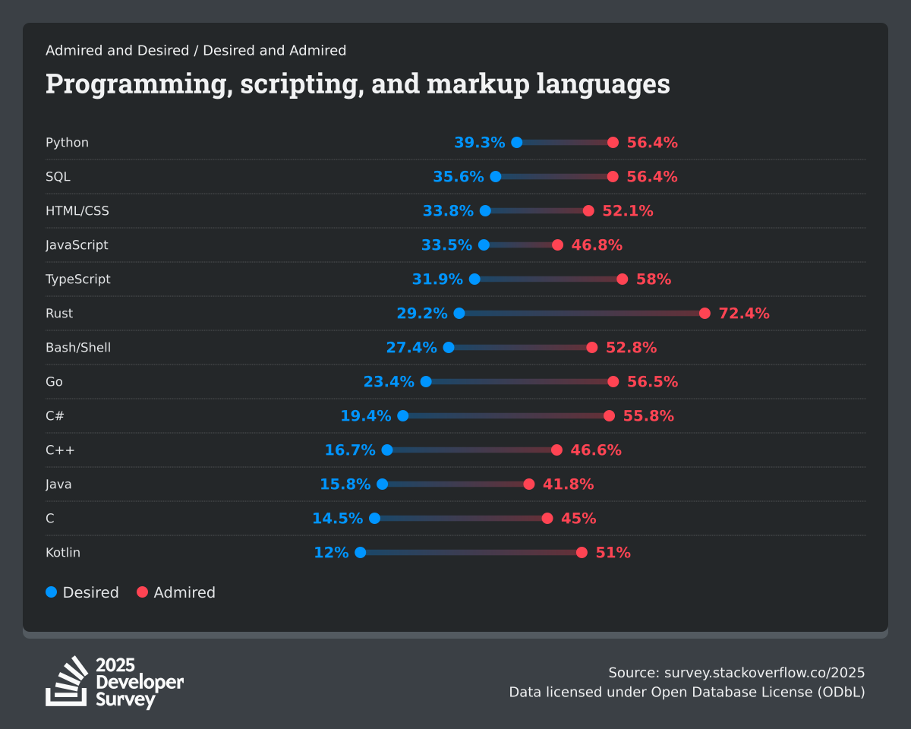

# Hvorfor er så mange interesserte i Rust?

Rust har i ni år på rad blitt kåret til det høyest beundrede programmeringsspråket blant brukerne på Stack Overflow.
I 2025 var det 72 % av Rust-utviklere som sa at de ville fortsette å bruke språket.

Les gjerne:

* [Why the developers who use Rust love it so much](https://stackoverflow.blog/2020/06/05/why-the-developers-who-use-rust-love-it-so-much/)
* [7 Reasons to Use Rust for Your Next Development Project](https://geekflare.com/reasons-to-use-rust/)

## Hva er greia med Rust?

Rust er et multi-paradigmespråk, spesielt egnet for oppgaver som krever høy ytelse, pålitelighet og parallellitet. Det
kompilerer til binærkode, og brukes kanskje i størst grad for systemutvikling, det en ofte kan bruke C og C++ til. Rust
kan også kompilere til [WebAssembly](https://webassembly.org/), som gjør det mulig å dra nytte av den høye ytelsen også
i webapplikasjoner.

Rust er spesielt kjent for:

* **Null-sikkerhet**: Rust har ingen null-pekere, og håndterer i stedet fravær av verdi gjennom `Option<T>`, som tvinger
  utviklere til å eksplisitt håndtere tilfeller der en verdi kan være fraværende.

* **Minnesikkerhet**: Rust sikrer minnesikkerhet ved kompileringstid. Det gjør den ved å bruke en variabels _scope_.

* **Tråd-sikkerhet**: På grunn av hvordan Rust håndterer referanser til minne (gjennom konseptene _låning_ og
  _flytting_,
  som håndheves av _lånesystemet_ (eng. _borrow checker_) og variablers levetid, er Rust garantert å være tråd-sikkert.

* **Cargo**: Litt som _npm_ + _ESlint_ + _prettier_ + _Jest_. Tar seg av å kompilere koden, installere pakker, håndtere
  avhengigheter,
  lintsjekke koden din, kjøre tester. _Batterier inkludert_, med andre ord.

* **En hyggelig kompilator**: Rust-kompilatoren er spesielt velskreven, og kan ofte fortelle deg nøyaktig hvor i koden
  noe er feil, og kan foreslå hva du bør gjøre i stedet. (Cargo!)

> Kompileringssteget i Rust kan ofte oppfattes strengt, men gjennom å tvinge deg til å eksplisitt håndtere alt som kan
> feile, og å luke ut flere klasser av feil i kompileringssteget, gjør
> det at tiden til _debugging_ kuttes drastisk ned. Feilmeldingene fra kompilatoren gjør dette til en hyggelig oppgave.
